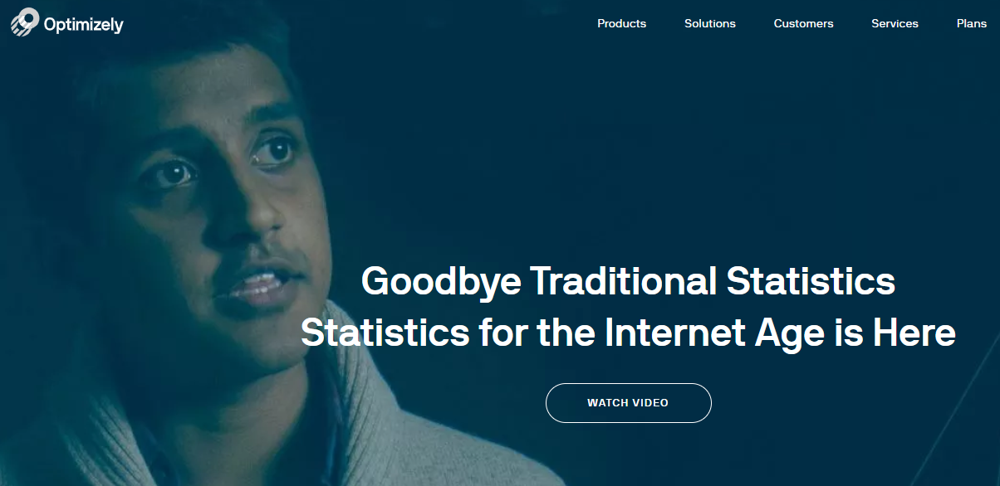

Tales from the Front Line: How Statistics is REALLY used in the (Tech) Industry
========================================================
author: Giora Simchoni
date: December 18th, 2018
autosize: true

EMR-IBS 2018

This RPres/html is available at Github or at:
http://bit.ly/emribs2018

Who am I
========================================================

- Graduated MSc Statistics from TAU in 2010
- Data Scientist (otherwise they won't hire me) subspecies Statistician
- 888 2 years, ebay 3 years, IBM 1.5 years, vFunction less than a year
- Blogger: [Sex, Drugs and Data](http://giorasimchoni.com)
- R/Python enthusiast: [Github](https://github.com/gsimchoni)
- Here to talk about the Horror I've seen

Attack of the Automated Tests
========================================================
title: FALSE
type: back_image

# Attack of the Automated Tests

I dare not say "Randomized Controlled Experiment"
========================================================

- ebay holds dozens of A/B Tests on millions of users, at any given time
- ebay prides itself on being "Data-Driven"
- No feature will be released until it passed the alpha = 0.05 threshold
- The one dependent variable that matters: `$$$`
- A t-test. Always a t-test.
- Automated platform for a Product Manager to define experiment, submit it and see the results
- N is in the millions, what could possibly go wrong?

What could possibly go wrong?
========================================================

- This is a real ebay experiment, from 2012 ([source](https://users.soe.ucsc.edu/~draper/Reading-2015-Day-5.html))
- Results were analyzed by David Draper of UC Santa Cruz, post mortem
- 12M users in Control group (no new feature) spent 8c more on average, than 12M users in Treatment group (new feature)
- p = 0.18
- Result: Feature not deployed

No one looks at Histograms, let alone Boxplots
========================================================

A simple Sensitivity Analysis
========================================================

Multiple Testing Carnage
========================================================
title: FALSE
type: back_image

# Multiple Testing Carnage

Remember "The Platform"?
========================================================

You get a P-value, you get a P-value!
========================================================

- There are countless web start-ups offering "a platform" for A/B tests
- A typical package: configuration, analysis and reporting
- A shiny email delivered to your "doorstep" daily, containing 3D pie-charts and the P-value between the A and B groups:
  - for yesterday
  - for the entire period
  - for men, for women
  - for people below 35, for people over 35 (or, you get to choose! Why so traditional?)
  - for users from US, for users from UK
- You get the picture.

The Battle of Inference
========================================================
title: FALSE
type: back_image

# The Battle of Inference

Can you predict if a handbag will sell or not?
========================================================

- Gathered 120K random handbags
- Left out 20K random handbags as validation set
- And additional 20K as testing set
- Of the remaining 80K training set about 8K sold
- Took 8K which sold + random 8K which did not sell
- Feature Engineering Galore
- Balanced dataset, tried LR, SVM, GBT, RF, NN...
- RF had the best result on validation set in AUC terms, say 90% precision and 80% recall with cutoff score of 0.5
- Chose RF, trained on training + validation sets, reported results on testing set

But we have 20 millions handbags at any given moment!
========================================================

- Learned Scala (~1 week)
- Learned Spark (~1 week)
- Completely re-written Data extraction, Feature Engineering and RF code(~2-3 months)
- Fitted RF model on 2M sold handbags vs. 2M unsold
- Result: 90% precision and 80% recall with cutoff score of 0.5

Rubber Stamp Offensive
========================================================
title: FALSE
type: back_image

# Rubber Stamp Offensive

And there are, of course Project Managers and Product People
========================================================

- A team of 20 people has worked for over a year on a new platform for an online gambling site
- The platform uses modern architecture, is slicker, more flexible, allows for never before seen gaming features
- Again, the A/B Test
- Typically each step in the Conversion funnel is tested with a proportion test:

Invasion of Data Science
========================================================
title: FALSE
type: back_image

# Invasion of Data Science
